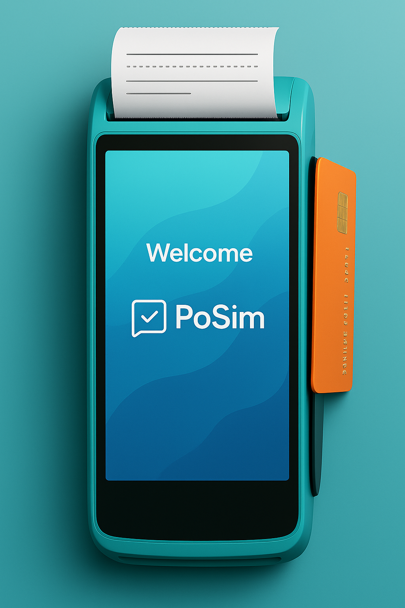

# PoSim – POS Terminal Emulator

A professional POS (Point of Sale) terminal emulator written in **C++17** using **LVGL** for UI rendering.  
Perfect for embedded system developers or anyone interested in building a payment terminal UI simulation.



---

## Tech Stack

- **C++17**
- **LVGL (Light and Versatile Graphics Library)**
- **CMake**
- Modular architecture with GUI, core logic, and transaction controller separation

---

## Project Structure

```
PoSim/
├── src/
│   ├── core/
│   ├── gui/
│   └── states/
├── include/
│   ├── plog/
│   └── cxxtimer.h
├── assets/
├── test/
├── CMakeLists.txt
├── main.cpp
└── README.md
```

---

## Architecture Overview

### Event Loop

The `EventLoop` class acts as a central processor for **system-level asynchronous events**.  
It continuously pulls from a queue of registered *event sources* (as `std::function<void()>`) and checks for hardware or logical events such as:

- Keypad presses
- Timer timeouts
- Touch events

When an event is detected, it gets pushed to the **StateMachine's Event Queue** for handling.

### State Machine

The core application logic is managed by a **finite state machine (FSM)**.  
Each screen or interaction phase is modeled as a `State` class with the following methods:

- `entry()` – called when entering the state (e.g., render keypad)
- `handle(Event)` – processes events while in the state
- `exit()` – called before transitioning to a new state

### Event Flow

```
+-------------+        push        +-----------------+        dispatch       +------------------+
| Any source  |  ───────────────▶  |   Event Queue   |  ─────────────────▶   | Current State    |
| (GUI, IO)   |                    +-----------------+                       | handle(event) |
+-------------+                                                              +------------------+
```

### Benefits

- Fully decoupled components
- Cleanly testable states and event logic
- Easy to extend: just add new states or event types

---

## Build Instructions

```bash
mkdir build
cd build
cmake ..
make
./posim
```

> Make sure LVGL is correctly included or linked. Simulator mode is supported.

---

## Commit Message Convention

This project follows the [Conventional Commits](https://www.conventionalcommits.org/) standard.

### Types

- `feat`: New feature
- `fix`: Bug fix
- `docs`: Documentation only changes
- `style`: Code formatting (no logic change)
- `refactor`: Code refactoring (no behavior change)
- `test`: Adding or updating tests
- `chore`: Build or CI config, tooling, etc.

### Examples

```bash
feat(gui): add welcome screen layout
fix(controller): handle null pointer in transaction flow
refactor(core): split logic into smaller modules
docs: update build instructions in README
```

---

## License

MIT
